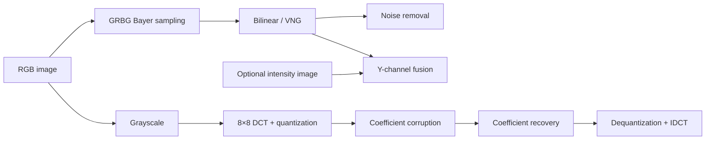

# Multimedia Image Processing Experiments

Python experiments for understanding two core stages of a multimedia imaging pipeline:

1. **Bayer demosaicing and denoising**
2. **JPEG-style DCT compression, coefficient corruption, and recovery**

The project was originally developed as a multimedia engineering course project and has been refactored from a linear Colab notebook into a reproducible command-line program with reusable functions and deterministic random seeds.

## Highlights

- GRBG Bayer mosaicking and Bilinear/VNG demosaicing comparison
- Channel-dependent Gaussian sensor-noise simulation
- Demosaic-before-denoise vs. denoise-before-demosaic evaluation
- YCrCb intensity fusion for hybrid Bayer/intensity sensing
- 8×8 DCT, JPEG quantization, inverse reconstruction, and PSNR/SSIM evaluation
- Additive, dropout, sign-flip, and coefficient-shift corruption models
- Zero, mean, DC/AC hybrid, and cubic-spline recovery strategies

## Reported results

The following values were measured in the original report using one 774×620 input image. Noise experiments are stochastic; exact values depend on the random seed.

| Experiment | Baseline | Proposed / Best result |
|---|---:|---:|
| Demosaicing | Bilinear 38.22 dB | VNG **43.25 dB** |
| Demosaicing SSIM | Bilinear 0.9800 | VNG **0.9901** |
| Processing order under channel noise | Denoise → demosaic 25.00 dB | Demosaic → denoise **30.87 dB** |
| Clean intensity fusion | VNG 43.25 dB | VNG + intensity **44.85 dB** |
| Noisy hybrid sensing | Bayer only 21.73 dB | Bayer + intensity **27.50 dB** |
| JPEG reconstruction | - | **39.46 dB / SSIM 0.9964** |
| 10% coefficient loss recovery | Zero 22.01 dB | DC/AC hybrid **33.67 dB** |

### Reproducibility correction

The original notebook reported baseline-level performance for cubic-spline recovery. Code review found that the assignment operated on a temporary array returned by `flatten()` and that the recovery array started from the uncorrupted coefficients. The refactored implementation starts from the corrupted coefficient array and writes through a reshaped view. The original spline result is therefore intentionally not presented as a valid project outcome and must be re-measured with this version.

## Pipeline



## Installation

```bash
python -m venv .venv

# Windows
.venv\Scripts\activate

# macOS / Linux
source .venv/bin/activate

pip install -r requirements.txt
```

## Usage

Run the full experiment suite with any RGB image:

```bash
python multimedia_project.py path/to/input.jpg --output-dir outputs --seed 42
```

The command writes:

- `metrics.json` with experiment settings and measured results
- `demosaicing_comparison.png`
- `noise_order_comparison.png`
- `intensity_fusion.png`
- `jpeg_corruption.png`
- `coefficient_recovery.png`

## Engineering notes

- Input dimensions are cropped to even values without interpolation before Bayer sampling.
- DCT experiments pad the grayscale image to multiples of eight.
- Random experiments use NumPy's explicit `Generator` and a configurable seed.
- PSNR and SSIM are always measured against the correctly aligned ground truth.
- Coefficient-recovery methods receive the same loss mask for a fair comparison.

## Limitations

- The original reported values were obtained from a single input image and should not be interpreted as dataset-level benchmarks.
- The intensity-fusion experiment assumes an aligned intensity sensor.
- Cubic interpolation follows flattened coefficient order, which is a simplified model rather than a JPEG-specific scan model.
- This repository focuses on algorithmic experiments and does not implement entropy coding or a complete JPEG bitstream.

## Privacy

The public repository excludes the original course report because it contains personal identifiers. Only anonymized aggregate results and refactored source code are included.

## License

MIT
