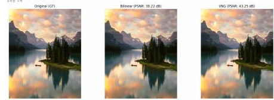
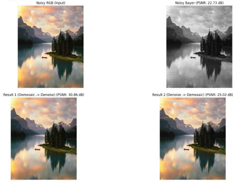
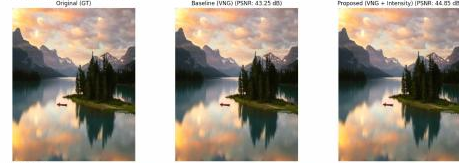
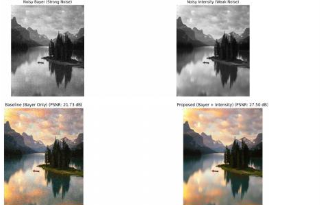
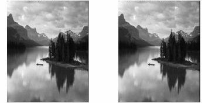
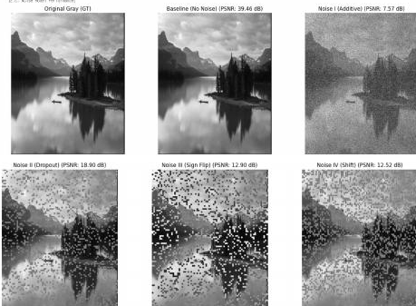

# 멀티미디어 영상처리 실험

**한국어** | [English](README.en.md)

멀티미디어 영상 파이프라인의 두 핵심 단계인 **Bayer 디모자이킹 및 잡음 제거**와 **JPEG 방식 DCT 압축, 계수 손상 및 복원**을 분석하고 구현한 Python 프로젝트입니다.

멀티미디어공학 수업 프로젝트의 선형적인 Colab 코드를 재사용 가능한 함수와 명령행 프로그램으로 리팩터링하고, 난수 시드를 고정해 실험을 재현할 수 있도록 개선했습니다.

## 핵심 구현

- GRBG Bayer 모자이크 생성 및 Bilinear/VNG 디모자이킹 비교
- 채널별 Gaussian 센서 잡음 시뮬레이션
- 디모자이킹과 잡음 제거의 처리 순서 비교
- Bayer 영상과 intensity 영상의 YCrCb 밝기 채널 결합
- 8x8 DCT, JPEG 양자화, 역변환 및 PSNR/SSIM 평가
- Additive, dropout, sign-flip, coefficient-shift 손상 모델
- Zero, mean, DC/AC hybrid 및 cubic-spline 계수 복원 전략

## 주요 실험 결과

아래 수치는 원본 보고서에서 774x620 입력 영상 한 장을 대상으로 측정한 결과입니다. 잡음 실험 결과는 난수 시드에 따라 달라질 수 있습니다.

| 실험 | 기준 결과 | 제안/최고 결과 |
|---|---:|---:|
| 디모자이킹 | Bilinear 38.22 dB | VNG **43.25 dB** |
| 디모자이킹 SSIM | Bilinear 0.9800 | VNG **0.9901** |
| 채널 잡음 환경의 처리 순서 | Denoise -> demosaic 25.00 dB | Demosaic -> denoise **30.87 dB** |
| 깨끗한 intensity 결합 | VNG 43.25 dB | VNG + intensity **44.85 dB** |
| 잡음 환경의 하이브리드 센싱 | Bayer only 21.73 dB | Bayer + intensity **27.50 dB** |
| JPEG 복원 | - | **39.46 dB / SSIM 0.9964** |
| 10% 계수 손실 복원 | Zero 22.01 dB | DC/AC hybrid **33.67 dB** |

## 시각적 결과

아래 비교 이미지는 원본 실험 보고서에서 결과 영역만 추출한 것입니다. 이름, 학번 등 개인정보와 보고서 메타데이터는 포함하지 않았습니다.

### 디모자이킹 및 처리 순서



VNG는 Bilinear의 38.22 dB보다 높은 43.25 dB를 기록했습니다. 채널별 Bayer 잡음 환경에서는 디모자이킹 후 잡음을 제거하는 순서가 반대 순서보다 세부 정보를 더 잘 보존했습니다.



### Intensity 채널 결합



복원된 밝기 채널을 정렬된 intensity 관측값으로 교체해 깨끗한 영상의 PSNR을 44.85 dB까지 높였습니다. 잡음 환경에서도 Bayer 단독 방식의 21.73 dB를 하이브리드 센싱 방식으로 27.50 dB까지 개선했습니다.



### JPEG 방식 변환 실험



8x8 DCT와 양자화 파이프라인은 영상을 PSNR 39.46 dB, SSIM 0.9964로 복원했습니다. 서로 다른 계수 손상은 역변환 후 공간 영역에서 손상 유형별로 구분되는 artifact를 만들었습니다.



### 재현성 관련 정정

원본 노트북은 cubic-spline 복원 결과가 손상 전 기준 성능과 동일하다고 보고했습니다. 코드 검토 결과 `flatten()`이 반환한 임시 배열에 값을 대입했고, 복원 배열도 손상된 계수가 아닌 원본 계수에서 시작한 문제가 확인됐습니다. 리팩터링한 구현은 손상된 계수 배열에서 시작하고 reshape한 view에 직접 값을 기록하도록 수정했습니다. 따라서 원본 Spline 수치는 유효한 결과로 제시하지 않으며, 현재 버전으로 다시 측정해야 합니다.

## 처리 파이프라인


## 설치 및 실행

```bash
python -m venv .venv

# Windows
.venv\Scripts\activate

# macOS / Linux
source .venv/bin/activate

pip install -r requirements.txt
python multimedia_project.py path/to/input.jpg --output-dir outputs --seed 42
```

실행 결과로 `metrics.json`과 디모자이킹, 잡음 처리 순서, intensity 결합, JPEG 계수 손상 및 복원 비교 이미지가 생성됩니다.

## 구현 및 검증 관점

- Bayer 샘플링 전 입력 영상의 가로·세로 크기를 보간 없이 짝수로 정리합니다.
- DCT 실험에서는 grayscale 영상을 8의 배수 크기로 padding합니다.
- NumPy `Generator`와 사용자 지정 시드로 난수 실험을 재현합니다.
- PSNR과 SSIM은 위치가 정확히 정렬된 ground truth를 기준으로 계산합니다.
- 공정한 비교를 위해 모든 계수 복원 방법에 동일한 손실 mask를 적용합니다.
- 핵심 처리 함수에 대한 자동 테스트 4개를 GitHub Actions에서 실행합니다.

## 한계

- 보고된 수치는 단일 입력 영상으로 얻은 결과이므로 데이터셋 단위 benchmark로 해석할 수 없습니다.
- Intensity 결합 실험은 두 센서 영상이 정렬되어 있다고 가정합니다.
- Cubic 보간은 JPEG scan 순서가 아닌 평탄화된 계수 순서를 사용하는 단순화된 모델입니다.
- Entropy coding이나 완전한 JPEG bitstream은 구현하지 않았습니다.

## 개인정보 보호

원본 수업 보고서에는 개인정보가 포함되어 있어 저장소에 공개하지 않았습니다. 공개 저장소에는 개인정보를 제거한 결과 이미지, 정량 지표 및 리팩터링한 소스 코드만 포함합니다.

## 라이선스

MIT
